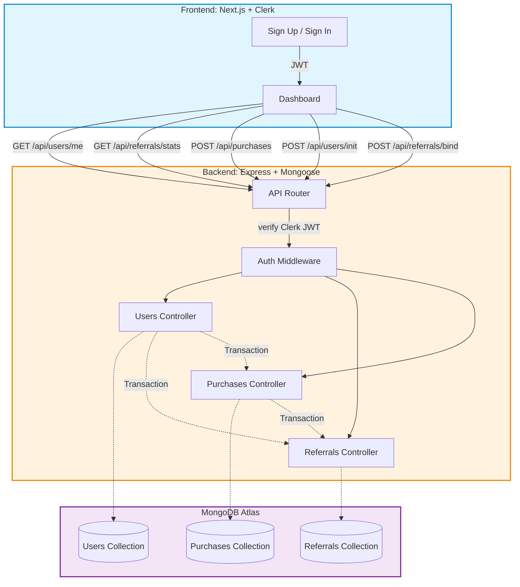

# CredFlow – Referral & Credit System

> A comprehensive referral and credit program for digital product platforms. Users can register, share unique referral links, earn credits on first-purchase conversions, and track detailed metrics through an intuitive dashboard.

---
## Live Demo : [Click Here](https://credflow-xdcf.onrender.com) 

---

## 🚀 Features

### Core Functionality
- **Secure Authentication** – Powered by Clerk for robust user management
- **Unique Referral Links** – Every user gets a personalized referral code
- **Dual Credit Rewards** – 2 credits awarded to both referrer and referred user on first purchase
- **Purchase Simulation** – Test the complete flow with simulated product purchases
- **Fraud Prevention** – Automatic duplicate crediting protection

### Dashboard Metrics
- Total referred users count
- Conversion tracking (referred → purchased)
- Lifetime credits earned
- One-click referral link copying
- Real-time statistics

### Technical Highlights
- Clean, modular architecture
- Type-safe development with TypeScript
- Responsive design optimized for all devices
- RESTful API design
- Comprehensive error handling

---

## 🧠 Tech Stack

| Layer | Technology |
|-------|-----------|
| **Frontend** | Next.js, TypeScript, Tailwind CSS, Zustand, Framer Motion |
| **Backend** | Node.js, Express, TypeScript |
| **Database** | MongoDB with Mongoose ODM |
| **Authentication** | Clerk |
| **Deployment** | Render (Backend + Static Frontend) |

---

## 📦 Project Structure

```
root/
├── backend/          # Express API server
│   ├── src/
│   │   ├── models/       # Mongoose schemas
│   │   ├── routes/       # API endpoints
│   │   ├── middleware/   # Auth & validation
│   │   └── server.ts     # Entry point
│   ├── package.json
│   └── tsconfig.json
│
└── frontend/         # Next.js application
    ├── src/
    │   ├── app/          # App router pages
    │   ├── components/   # React components
    │   ├── store/        # Zustand state
    │   └── lib/          # Utilities
    ├── package.json
    └── next.config.js
```

---
## Architecture


---

## ⚙️ Environment Configuration

### Backend `.env`

```bash
PORT=8080
MONGODB_URI=your_mongodb_connection_string
CLERK_SECRET_KEY=your_clerk_secret_key
CLERK_PUBLISHABLE_KEY=your_clerk_publishable_key
CLIENT_ORIGIN=http://localhost:3000
```

### Frontend `.env.local`

```bash
NEXT_PUBLIC_CLERK_PUBLISHABLE_KEY=your_clerk_publishable_key
NEXT_PUBLIC_API_BASE=http://localhost:8080
NEXT_PUBLIC_APP_BASE=http://localhost:3000
```

> **Note**: Create `.env.example` files with placeholder values before committing to version control.

---

## 🛠️ Local Development Setup

### Prerequisites
- Node.js 18+ (macOS M1 compatible)
- MongoDB instance (local or Atlas)
- Clerk account with API keys

### Installation Steps

**1. Clone the repository**
```bash
git clone https://github.com/yourusername/credflow.git
cd credflow
```

**2. Backend Setup**
```bash
cd backend
npm install
npm run build
npm start
```
Server runs on `http://localhost:8080`

**3. Frontend Setup**
```bash
cd ../frontend
npm install
npm run dev
```
Application runs on `http://localhost:3000`

**4. Verify Installation**
- Navigate to `http://localhost:3000`
- Sign up with a test account
- Check console for any errors


## 🧩 API Documentation

### Endpoints Overview

| Method | Endpoint | Description | Auth Required |
|--------|----------|-------------|---------------|
| `POST` | `/api/users/init` | Create or ensure user exists | ✅ |
| `GET` | `/api/users/me` | Retrieve authenticated user info | ✅ |
| `GET` | `/api/referrals/stats` | Get referral statistics | ✅ |
| `POST` | `/api/referrals/bind` | Bind referral code to user | ✅ |
| `POST` | `/api/purchases` | Simulate product purchase | ✅ |
| `GET` | `/api/health` | Health check endpoint | ❌ |

### Example Request

**Get User Stats**
```bash
curl -X GET http://localhost:8080/api/referrals/stats \
  -H "Authorization: Bearer YOUR_CLERK_TOKEN"
```

**Response**
```json
{
  "totalReferred": 5,
  "convertedUsers": 3,
  "totalCredits": 6,
  "referralCode": "ABC123XYZ"
}
```

---

## 🧬 System Architecture

### High-Level Architecture

```
┌─────────────────────────────────────────────────────────────┐
│                    CLIENT LAYER                              │
│  ┌────────────────────────────────────────────────────┐     │
│  │  Next.js Frontend (Port 3000)                      │     │
│  │  - Authentication UI (Clerk)                       │     │
│  │  - Dashboard & Metrics                             │     │
│  │  - Referral Link Management                        │     │
│  └────────────────────────────────────────────────────┘     │
└──────────────────────────┬──────────────────────────────────┘
                           │ HTTPS/REST API
                           ▼
┌─────────────────────────────────────────────────────────────┐
│                    SERVER LAYER                              │
│  ┌────────────────────────────────────────────────────┐     │
│  │  Express API (Port 8080)                           │     │
│  │  ┌──────────────────────────────────────────┐     │     │
│  │  │  Clerk JWT Verification Middleware       │     │     │
│  │  └──────────────────────────────────────────┘     │     │
│  │  ┌──────────────────────────────────────────┐     │     │
│  │  │  Route Handlers                          │     │     │
│  │  │  - Users Controller                      │     │     │
│  │  │  - Referrals Controller                  │     │     │
│  │  │  - Purchases Controller                  │     │     │
│  │  └──────────────────────────────────────────┘     │     │
│  └────────────────────────────────────────────────────┘     │
└──────────────────────────┬──────────────────────────────────┘
                           │ Mongoose ODM
                           ▼
┌─────────────────────────────────────────────────────────────┐
│                  DATABASE LAYER                              │
│  ┌────────────────────────────────────────────────────┐     │
│  │  MongoDB                                           │     │
│  │  ┌──────────────┐  ┌──────────────┐  ┌─────────┐ │     │
│  │  │    Users     │  │  Referrals   │  │Purchases│ │     │
│  │  │ Collection   │  │  Collection  │  │Collection│ │     │
│  │  └──────────────┘  └──────────────┘  └─────────┘ │     │
│  └────────────────────────────────────────────────────┘     │
└─────────────────────────────────────────────────────────────┘
```

### Data Flow Diagram

**User Registration & Referral Flow:**

```
1. User Sign Up
   │
   ├─> Clerk Authentication
   │
   ├─> POST /api/users/init
   │   └─> Create User Record
   │       └─> Generate Unique Referral Code
   │
   └─> Redirect to Dashboard

2. Referral Binding (Optional)
   │
   ├─> Check URL for Referral Code
   │
   ├─> POST /api/referrals/bind
   │   └─> Validate Code
   │       └─> Create Referral Relationship
   │
   └─> Store Referrer-Referee Link

3. First Purchase
   │
   ├─> POST /api/purchases
   │   └─> Check if First Purchase
   │       ├─> Award 2 Credits to Buyer
   │       └─> Award 2 Credits to Referrer (if exists)
   │
   └─> Update Purchase Records

4. Dashboard View
   │
   ├─> GET /api/users/me
   │
   ├─> GET /api/referrals/stats
   │   └─> Calculate Metrics
   │       ├─> Total Referred Count
   │       ├─> Converted Users Count
   │       └─> Total Credits Earned
   │
   └─> Render Statistics
```

---


---

## 🔒 Security Considerations

- **Authentication**: All API routes protected with Clerk JWT verification
- **Input Validation**: Server-side validation for all user inputs
- **Rate Limiting**: Recommended for production (not included in MVP)
- **Environment Variables**: Sensitive keys stored in environment config
- **CORS**: Configured to allow only trusted origins

---

## 🧪 Testing

### Manual Testing Checklist

1. **User Registration**
   - Sign up with new account
   - Verify user record in database
   - Check referral code generation

2. **Referral Flow**
   - Share referral link
   - Sign up via referral link
   - Verify referral binding

3. **Purchase Flow**
   - Make first purchase
   - Verify credit allocation
   - Attempt duplicate purchase
   - Confirm no duplicate credits

4. **Dashboard**
   - Check metric accuracy
   - Test referral link copy
   - Verify real-time updates

---

## 📈 Future Enhancements

- [ ] Email notifications for referral conversions
- [ ] Credit redemption system
- [ ] Multi-tier referral rewards
- [ ] Analytics dashboard with charts
- [ ] Admin panel for monitoring
- [ ] Automated testing suite
- [ ] Rate limiting middleware
- [ ] Webhook integration for real-time events

---

## 📄 Repository Contents

```
✓ Complete source code (frontend + backend)
✓ README with comprehensive documentation
✓ .env.example files for both layers
✓ Architecture diagrams (text-based)
✓ API endpoint documentation
✓ Deployment configuration guides
✓ Incremental Git commit history
```

---

## 🤝 Contributing

Contributions are welcome! Please follow these steps:

1. Fork the repository
2. Create a feature branch (`git checkout -b feature/AmazingFeature`)
3. Commit your changes (`git commit -m 'Add some AmazingFeature'`)
4. Push to the branch (`git push origin feature/AmazingFeature`)
5. Open a Pull Request

---

## 📞 Support

For questions or issues:
- Open an issue on GitHub
- Contact: vendotha@gmail.com

---

## 📝 License

This project is licensed under the MIT License - see the LICENSE file for details.

---

## 🎯 Project Status

**Current Version**: 1.0.0  
**Status**: Production Ready  
**Last Updated**: November 2025

---

<div align="center">

**Built with ❤️ by Vendotha*

*Demonstrating clean code, scalable architecture, and modern development practices*

[Live Demo](https://credflow-xdcf.onrender.com) • [Documentation](#) • [Report Bug](mailto:vendotha@gmail.com)

</div>
