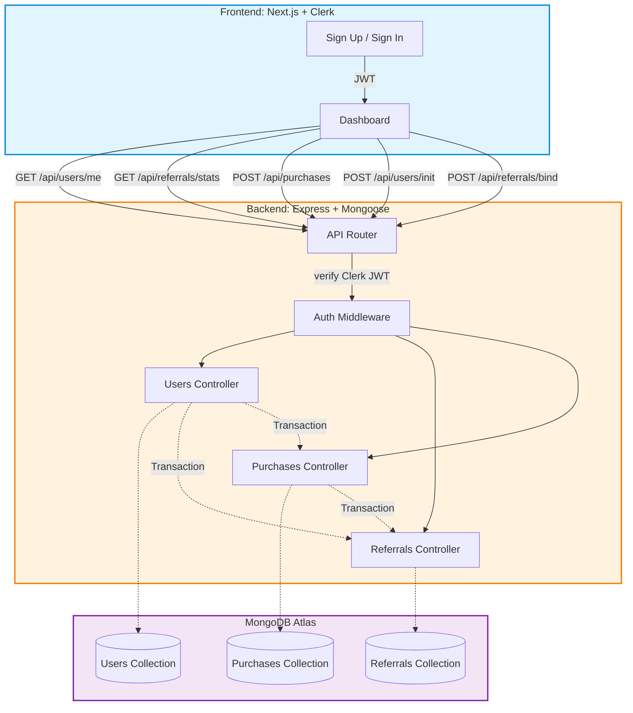

```mermaid
flowchart TB
    subgraph Client["Frontend: Next.js + Clerk"]
        A[Sign Up / Sign In]
        B[Dashboard]
        A -->|JWT| B
    end
    
    subgraph Backend["Backend: Express + Mongoose"]
        API[API Router]
        Auth[Auth Middleware]
        Users[Users Controller]
        Referrals[Referrals Controller]
        Purchases[Purchases Controller]
        
        API -->|verify Clerk JWT| Auth
        Auth --> Users
        Auth --> Referrals
        Auth --> Purchases
    end
    
    subgraph DB["MongoDB Atlas"]
        U[(Users Collection)]
        R[(Referrals Collection)]
        P[(Purchases Collection)]
    end
    
    B -->|GET /api/users/me| API
    B -->|GET /api/referrals/stats| API
    B -->|POST /api/purchases| API
    B -->|POST /api/users/init| API
    B -->|POST /api/referrals/bind| API
    
    Users -.-> U
    Referrals -.-> R
    Purchases -.-> P
    
    Purchases -.->|Transaction| Referrals
    Users -.->|Transaction| Referrals
    Users -.->|Transaction| Purchases
    
    style Client fill:#e1f5ff,stroke:#0288d1,stroke-width:2px
    style Backend fill:#fff3e0,stroke:#f57c00,stroke-width:2px
    style DB fill:#f3e5f5,stroke:#7b1fa2,stroke-width:2px
```
